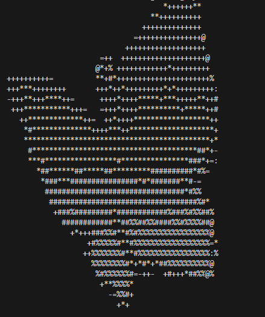
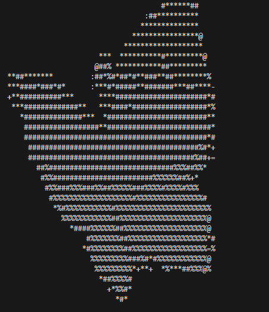
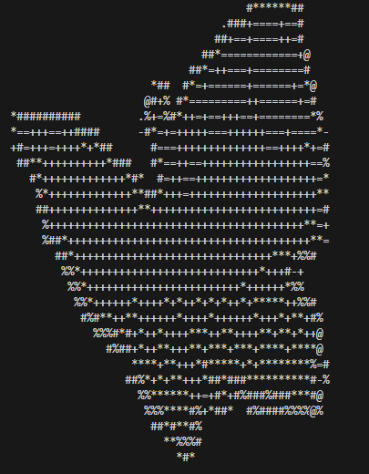

# ASCII Art Video & Image in Python
This repository contains a Python project I made for fun. I convert images and videos into ASCII art, testing different methods like gamma, edge enhancement, and colorization to compare results.

---

## Version 1: Grayscale / Gamma Correction
> `version1.py`  
Converts images to ASCII using grayscale conversion (`image.convert("L")`) and gamma adjustment to make the image a bit darker or lighter.  

> Gamma:  
> `<1 = Lighter, >1 = Darker`

| Original | Version 1 |
|----------|-----------|
|  |  |

---

## Auto Contrast
Automatically normalizes pixel brightness to maximize dynamic range, making details stand out more.

| Original | Auto Contrast |
|----------|---------------|
|  |  |

---

## Edge Enhanced
Adds edge detection to ASCII, giving the output more definition and detail.

| Original | Edge Enhanced |
|----------|---------------|
|  |  |

---

## Colorized ASCII
Adds color to ASCII using either a minimalist palette or full RGB mapping.

| Original | Color Minimalist | Color Full |
|----------|-----------------|------------|
|  |  |  |

> `color2.png` is another experimental variation.

---

## Video Player
Plays an MP4 video in the terminal as live ASCII frames synced with audio.  

- Video file: `fish.mp4` 
- Output: `fish_ascii.mp4` (or live playback in terminal):

https://github.com/user-attachments/assets/2eceb43e-1b58-4cbf-9fce-cd28a36f6400

---

## Notes
- Terminal speed was one of the main reasons for terminal being slow
- Using sys.stdout.write() + flush() in the video player allowed to drastrically improve FPS compared to print()

## Possible Improvements
- Possible to precompute ASCII and use 8-bit colors instead to speed up process.
- Apparently the cmd for Windows is slower? You might find better results using gnome on Linux, etc.

---

### Usage

```bash
# Install requirements
pip install -r requirements.txt
# Run version 1 on an image
python version1.py

# Play live ASCII video
python ascii_video_player.py
